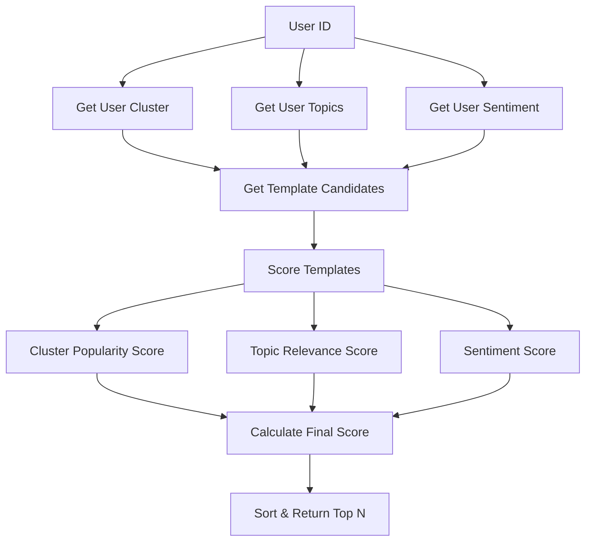

# Enhanced Template Recommendations System

## Overview

The Enhanced Template Recommendations system is an intelligent recommendation engine that suggests personalized prompt templates to users based on multiple factors:

1. **Collaborative Filtering** - Using user clustering to find similar users
2. **Topic Relevance** - Analyzing user's most active/frequent topics
3. **Sentiment Analysis** - Incorporating user satisfaction patterns from secret feedback
4. **Quality Metrics** - Weighing template efficacy and usage patterns

## Architecture

### Core Components

#### 1. Supervisor (`server/managers/Supervisor.js`)
- **Main Method**: `getTemplateRecommendationsForUser(userId, topic, options)`
- **Purpose**: Orchestrates the recommendation process
- **Dependencies**: UserClusterManager, SessionManager, FeedbackProcessor

#### 2. Data Sources
- **User Clusters**: `user_cluster_assignments` table - collaborative filtering
- **Session Topics**: `sessions.secret_topic` - user topic preferences  
- **Sentiment Data**: `secret_feedback` - user satisfaction patterns
- **Template Usage**: `prompt_template_usage` - template performance data

#### 3. Scoring Algorithm
Combines three weighted scores:
- **Cluster Popularity** (default: 40%) - How cluster members rate templates
- **Topic Relevance** (default: 35%) - Match with user's active topics
- **Sentiment Weight** (default: 25%) - Template quality + user sentiment patterns

## Implementation Details

### Algorithm Flow



### Scoring Components

#### 1. Cluster Popularity Score (0-1)
```javascript
// Factors:
// - Average rating from cluster members (normalized from 1-5 to 0-1)
// - Usage frequency bonus (more usage = higher confidence)
// - Defaults to 0.3 if no cluster, 0.2 if no cluster usage

const normalizedRating = (averageRating - 1) / 4;
const usageBonus = Math.min(usages.length / 10, 0.3);
return Math.min(normalizedRating + usageBonus, 1.0);
```

#### 2. Topic Relevance Score (0-1)
```javascript
// Exact match: 0.7 + (0.3 * frequency_ratio)
// Partial match: 0.4 + (0.2 * frequency_ratio)
// No match: 0.1
// No topics: 0.5 (neutral)

const exactMatch = userTopics.find(ut => ut.topic === templateTopic);
if (exactMatch) {
  const maxCount = userTopics[0].count;
  return 0.7 + (0.3 * (exactMatch.count / maxCount));
}
```

#### 3. Sentiment Score (0-1)
```javascript
// Base score from template efficacy (1-5 → 0.2-1.0)
// Adjusted by user sentiment patterns:
// - Positive users: boost high-quality templates
// - Negative users: be more conservative
// - Usage count bonus for well-tested templates

let baseScore = 0.2 + (template.efficacy_score - 1) / 4 * 0.8;
if (userSentiment.positivityRatio > 0.7 && baseScore > 0.6) {
  baseScore += 0.1;
}
```

## API Endpoints

### 1. GET /api/users/:userId/template-recommendations

Get basic template recommendations for a user.

**Parameters:**
- `userId` (path) - User identifier
- `topic` (query, optional) - Filter by specific topic
- `max_recommendations` (query, optional) - Max results (default: 10)
- `include_score_breakdown` (query, optional) - Include detailed scores

**Example:**
```bash
curl "http://localhost:3001/api/users/user123/template-recommendations?topic=mathematics&max_recommendations=5"
```

**Response:**
```json
{
  "success": true,
  "recommendations": [
    {
      "id": "template-uuid",
      "topic": "mathematics",
      "template_text": "{\"query_pattern\":\"...\"}",
      "efficacy_score": 4.2,
      "usage_count": 15,
      "finalScore": 0.867,
      "recommendationReason": "Recommended because it matches your frequently used topics and has excellent quality metrics"
    }
  ],
  "user_id": "user123",
  "topic": "mathematics",
  "total_count": 3
}
```

### 2. POST /api/users/:userId/template-recommendations

Get recommendations with custom weights and configuration.

**Body:**
```json
{
  "topic": "computer_science",
  "max_recommendations": 5,
  "include_score_breakdown": true,
  "weights": {
    "clusterPopularity": 0.6,
    "topicRelevance": 0.3,
    "sentimentWeight": 0.1
  }
}
```

**Response:**
```json
{
  "success": true,
  "recommendations": [
    {
      "id": "template-uuid",
      "topic": "computer_science",
      "finalScore": 0.834,
      "recommendationReason": "Recommended because it...",
      "scoreBreakdown": {
        "clusterPopularity": 0.85,
        "topicRelevance": 0.92,
        "sentimentWeight": 0.67,
        "weights": {"clusterPopularity": 0.6, "topicRelevance": 0.3, "sentimentWeight": 0.1}
      }
    }
  ],
  "weights": {...},
  "total_count": 3
}
```

### 3. GET /api/users/:userId/recommendation-insights

Get detailed insights about user's recommendation factors.

**Response:**
```json
{
  "success": true,
  "user_id": "user123",
  "cluster_info": {
    "cluster_id": "cluster-uuid",
    "similarity": 0.85,
    "member_count": 12,
    "user_preferences": {"technical_depth": 0.8, "visual_learning": 0.4}
  },
  "active_topics": [
    {"topic": "mathematics", "count": 15},
    {"topic": "algebra", "count": 8}
  ],
  "sentiment_stats": {
    "positive": 25,
    "negative": 3,
    "neutral": 7,
    "total": 35,
    "score": 22,
    "positivityRatio": 0.714
  },
  "insights": {
    "has_cluster": true,
    "topic_diversity": 5,
    "sentiment_trend": "positive"
  }
}
```

## Configuration Options

### Default Weights
```javascript
const defaultWeights = {
  clusterPopularity: 0.4,  // 40% - Collaborative filtering
  topicRelevance: 0.35,    // 35% - Topic matching
  sentimentWeight: 0.25    // 25% - Quality + sentiment
};
```

### Customization Examples

#### High Collaboration Focus
```javascript
const collaborativeWeights = {
  clusterPopularity: 0.7,
  topicRelevance: 0.2,
  sentimentWeight: 0.1
};
```

#### Topic-Driven Recommendations
```javascript
const topicWeights = {
  clusterPopularity: 0.2,
  topicRelevance: 0.6,
  sentimentWeight: 0.2
};
```

#### Quality-First Approach
```javascript
const qualityWeights = {
  clusterPopularity: 0.3,
  topicRelevance: 0.2,
  sentimentWeight: 0.5
};
```

## Testing

### Running Tests

```bash
# Run the comprehensive test
node test-enhanced-recommendations.js

# Clean up test data
node test-enhanced-recommendations.js --cleanup
```

### Test Coverage

The test script validates:
- ✅ User cluster analysis and collaborative filtering
- ✅ Topic identification from session history
- ✅ Sentiment analysis from secret feedback
- ✅ Multi-factor scoring algorithm
- ✅ Custom weight configuration
- ✅ API endpoint functionality
- ✅ Detailed score breakdown
- ✅ Recommendation reasoning

### Example Test Output

```
🚀 Starting Enhanced Template Recommendations Test

[TEST] Creating test data for enhanced recommendations...
[TEST] Test data creation completed!

=== Testing Enhanced Recommendations for Alice (Math Enthusiast) ===

📋 Basic Recommendations for Alice (Math Enthusiast):
1. Topic: algebra
   Score: 0.847
   Reason: Recommended because it matches your frequently used topics and highly rated by users with similar preferences
   Template ID: template-uuid-1

2. Topic: mathematics
   Score: 0.782
   Reason: Recommended because it matches your frequently used topics and has good user feedback
   Template ID: template-uuid-2

🔍 User Insights for Alice (Math Enthusiast):
Cluster Info: { clusterId: 'cluster-uuid', similarity: 0.85, memberCount: 1 }
Active Topics: [ { topic: 'mathematics', count: 3 }, { topic: 'algebra', count: 2 } ]
Sentiment Stats: { positive: 2, negative: 0, neutral: 1, total: 3, score: 2, positivityRatio: 0.667 }
```

## Database Schema Dependencies

### Required Tables

1. **user_cluster_assignments**
   - `user_id`, `cluster_id`, `similarity`, `preferences`

2. **sessions**
   - `user_id`, `secret_topic` (from topic classification)

3. **secret_feedback**
   - `user_id`, `feedback_type` (positive/negative/neutral)

4. **prompt_templates**
   - `id`, `topic`, `efficacy_score`, `usage_count`

5. **prompt_template_usage**
   - `template_id`, `user_id`, `feedback_score`

### Indexes for Performance

```sql
-- Essential indexes
CREATE INDEX idx_sessions_secret_topic ON sessions(secret_topic);
CREATE INDEX idx_sessions_user_topic ON sessions(user_id, secret_topic);
CREATE INDEX idx_feedback_user_type ON secret_feedback(user_id, feedback_type);
CREATE INDEX idx_template_usage_score ON prompt_template_usage(template_id, feedback_score);
CREATE INDEX idx_template_topic_efficacy ON prompt_templates(topic, efficacy_score);
```

## Integration Points

### 1. Query Processing Integration

```javascript
// In your main query handler
const supervisor = new Supervisor();
const recommendations = await supervisor.getTemplateRecommendationsForUser(
  userId, 
  detectedTopic
);

// Use top recommendation for prompt enhancement
if (recommendations.length > 0) {
  const bestTemplate = recommendations[0];
  enhancedPrompt = applyTemplate(userQuery, bestTemplate);
}
```

### 2. Dashboard Integration

```javascript
// Display personalized recommendations in user dashboard
const insights = await fetch(`/api/users/${userId}/recommendation-insights`);
const recommendations = await fetch(`/api/users/${userId}/template-recommendations?max_recommendations=3`);

// Show user their learning patterns and suggested improvements
```

### 3. Admin Analytics

```javascript
// Analyze recommendation effectiveness
const users = await getAllUsers();
for (const user of users) {
  const insights = await supervisor.getUserSentimentStats(user.id);
  const topics = await supervisor.getUserMostActiveTopics(user.id);
  // Generate analytics reports
}
```

## Performance Considerations

### Optimization Strategies

1. **Caching**: Cache cluster assignments and user topics
2. **Batch Processing**: Process multiple users in parallel
3. **Database Indexing**: Ensure proper indexes on join tables
4. **Lazy Loading**: Load score breakdowns only when requested

### Scaling

- **Horizontal**: Separate recommendation service
- **Vertical**: Add recommendation result caching
- **Database**: Consider read replicas for analytics queries

## Troubleshooting

### Common Issues

1. **No Recommendations Returned**
   - Check if user has cluster assignment
   - Verify session topics are populated
   - Ensure templates exist for user's topics

2. **Poor Recommendation Quality**
   - Adjust scoring weights
   - Verify template efficacy scores
   - Check cluster member similarity

3. **Performance Issues**
   - Add database indexes
   - Enable query caching
   - Consider async processing

### Debug Mode

Enable detailed logging:
```javascript
const recommendations = await supervisor.getTemplateRecommendationsForUser(
  userId, 
  topic, 
  { includeScoreBreakdown: true }
);

console.log('Score breakdown:', recommendations[0].scoreBreakdown);
```

## Future Enhancements

### Planned Features

1. **Machine Learning Integration**
   - Neural collaborative filtering
   - Deep learning for topic similarity

2. **Real-time Adaptation**
   - Update recommendations based on current session
   - A/B testing for weight optimization

3. **Advanced Analytics**
   - Recommendation effectiveness tracking
   - User satisfaction correlation analysis

4. **Personalization Engine**
   - Individual weight learning
   - Contextual recommendations

### Extensibility

The system is designed for easy extension:
- Add new scoring factors in `scoreTemplates()`
- Implement custom recommendation reasons
- Integrate additional data sources
- Support for custom user attributes

---

**For additional support or questions about the Enhanced Template Recommendations system, refer to the test script and API documentation above.** 