# Topic-Based Clustering System

## 🎯 Overview

The **Topic-Based Clustering System** is an improved clustering approach that prevents over-fragmentation by prioritizing **topic-based grouping** over strict vector similarity thresholds. This ensures that semantically related queries (like "What is recursion?" and "Explain recursive functions") are grouped together, even if their embeddings don't meet the cosine similarity threshold.

## ❌ Previous Problem: Over-Fragmentation

### What Was Happening
- **Strict Similarity Threshold**: Only queries with cosine similarity ≥ 0.75 were clustered together
- **Over-Fragmentation**: Similar concepts were split into separate clusters
- **Poor Template Reuse**: Each fragment got its own templates instead of learning from similar queries
- **Messy Analytics**: Hundreds of tiny clusters instead of meaningful topic groups

### Example of the Problem
```
❌ OLD BEHAVIOR:
"What is recursion in Python?" → Cluster 1 (similarity: 0.73)
"Explain recursive functions" → Cluster 2 (NEW cluster created!)
"Give an example of recursion" → Cluster 3 (NEW cluster created!)
```

## ✅ New Solution: Topic-Based Clustering

### Three-Strategy Approach

The new system uses a **hierarchical clustering strategy** with three fallback levels:

#### 🥇 **Strategy 1: Topic-Based Clustering**
1. **Classify the query topic** using OpenAI (e.g., "computer_science", "mathematics", "biology")
2. **Find existing clusters** for that topic by looking at:
   - Sessions with the same `secret_topic`
   - Interactions from those sessions that have `cluster_id` assignments
3. **Assign to the most populated cluster** for that topic
4. **Skip similarity checking** entirely for topic matches

#### 🥈 **Strategy 2: Similarity-Based Clustering (Fallback)**
- If no topic cluster exists, fall back to the original cosine similarity approach
- Uses the same 0.75 threshold as before
- Ensures we don't lose precision for edge cases

#### 🥉 **Strategy 3: New Cluster Creation**
- Only create a new cluster if both topic and similarity matching fail
- Store the topic with the new cluster for future topic-based matching

## 🔄 Complete Flow

```mermaid
graph TD
    A[User Query] --> B[Generate 1536D Embedding]
    B --> C[Classify Topic with OpenAI]
    C --> D{Topic ≠ 'general'?}
    
    D -->|Yes| E[Find Most Populated Cluster for Topic]
    E --> F{Topic Cluster Found?}
    F -->|Yes| G[✅ Assign to Topic Cluster]
    
    F -->|No| H[Try Similarity Matching]
    D -->|No| H
    
    H --> I{Similarity ≥ 0.75?}
    I -->|Yes| J[✅ Assign to Similar Cluster]
    I -->|No| K[🆕 Create New Cluster with Topic]
    
    G --> L[Apply Template Enhancement]
    J --> L
    K --> L
```



## 💡 Key Benefits

### 1. **Reduced Fragmentation**
```
✅ NEW BEHAVIOR:
"What is recursion in Python?" → Cluster 1 (topic: computer_science)
"Explain recursive functions" → Cluster 1 (same topic!)
"Give an example of recursion" → Cluster 1 (same topic!)
```

### 2. **Better Template Reuse**
- Related queries share templates and learn from each other
- Higher efficacy scores due to more usage data
- Fewer redundant templates

### 3. **Cleaner Analytics**
- Meaningful topic-based cluster groupings
- Easier to understand system behavior
- Better insights into learning patterns

### 4. **Smarter Learning**
- System learns topic patterns, not just vector patterns
- More robust to different phrasings of the same concept
- Better generalization across similar queries

## 🛠️ Implementation Details

### Database Changes

1. **Added `topic` column to `semantic_clusters` table**:
   ```sql
   ALTER TABLE semantic_clusters ADD COLUMN topic TEXT;
   ```

2. **Enhanced cluster creation to store topic**:
   ```javascript
   await supabase.from('semantic_clusters').insert({
     centroid: embedding,
     size: 1,
     representative_query: query,
     clustering_version: 'realtime',
     topic: topic  // 🎯 NEW: Store topic with cluster
   });
   ```

### New Methods in Supervisor.js

#### `classifyQueryTopic(query, openai)`
- Uses the same topic classification logic as the main server
- Returns topic names like "computer_science", "mathematics", "biology"
- Handles new topic creation automatically

#### `findMostPopulatedClusterForTopic(topic)`
- Searches for existing clusters that contain queries with the specified topic
- Returns the cluster with the most interactions for that topic
- Enables topic-based cluster assignment

#### Enhanced `createRealtimeCluster(embedding, query, topic)`
- Now accepts and stores the topic with the new cluster
- Future queries with the same topic will find this cluster

## 📊 Monitoring & Debugging

### New Log Messages
Look for these log entries to understand clustering decisions:

```
[Topic-Based Clustering] Query classified as topic: "computer_science"
[Topic-Based Clustering] ✅ Assigned to existing topic cluster: ID=5 (topic: computer_science, size: 12)
```

### Clustering Methods Tracking
The system now tracks how each query was clustered:
- `topic_based`: Assigned via topic matching
- `similarity`: Assigned via cosine similarity
- `new_cluster`: New cluster created
- `error_fallback`: Fallback due to error

### Response Metadata
Each query response now includes:
```javascript
{
  crowd_wisdom: {
    applied: true,
    template_id: "abc123",
    selection_method: "ucb1",
    clusteringMethod: "topic_based"  // 🆕 NEW
  },
  secret_topic: "computer_science"   // Topic used for clustering
}
```

## 🧪 Testing

### Run the Test Script
```bash
node test_topic_based_clustering.js
```

### Expected Results
- Queries in the same academic domain should get the same topic
- Related queries should be assigned to the same cluster
- Success rate should be ≥80% for topic consistency

### Test Categories
1. **Computer Science - Recursion**
2. **Mathematics - Calculus** 
3. **Biology - Cell Biology**
4. **Physics - Mechanics**

## 🔧 Configuration

### Topic Classification Prompt
The system uses the same topic classification logic as the main server. Topics include:
- Academic subjects: `mathematics`, `physics`, `computer_science`, `biology`
- Specific areas: `calculus`, `linear_algebra`, `algorithms`, `programming`
- General: `general` (for non-academic queries)

### Similarity Threshold
- Still uses **0.75** as the cosine similarity threshold
- Only applies when topic-based clustering fails
- Can be adjusted in `Supervisor.js` if needed

## 🚀 Future Enhancements

### Potential Improvements
1. **Topic Similarity**: Group related topics (e.g., `calculus` + `mathematics`)
2. **Cluster Merging**: Automatically merge clusters that get the same topic
3. **Topic Weights**: Prefer more specific topics over general ones
4. **Adaptive Thresholds**: Adjust similarity thresholds based on topic
5. **Cross-Topic Learning**: Share templates between closely related topics

### Analytics Enhancements
1. **Topic Distribution Reports**: See which topics are most popular
2. **Clustering Efficiency Metrics**: Track fragmentation reduction
3. **Template Efficacy by Topic**: Compare learning effectiveness across domains

## 🎉 Expected Impact

### Quantitative Improvements
- **50-70% reduction** in cluster fragmentation
- **30-50% increase** in template reuse
- **Better efficacy scores** due to more data per template
- **Cleaner analytics** with topic-based groupings

### Qualitative Improvements
- More logical cluster organization
- Better learning generalization
- Easier system debugging and monitoring
- More intuitive behavior for users and administrators

---

The Topic-Based Clustering System represents a significant improvement in how the crowd wisdom system organizes and learns from user queries. By prioritizing semantic topic understanding over strict vector similarity, it creates a more robust and efficient learning system. 